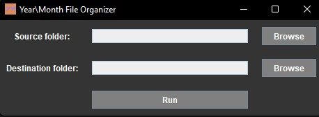
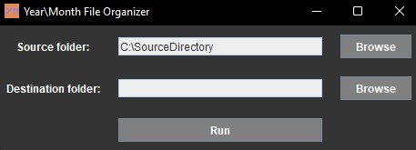
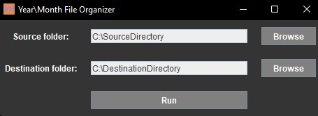

# Year\Month File Organizer
**YMFO** allows the user to transfer files from a directory to another one. However, the files in the destination directory are stored in [two levels of directories](#directory-structure) according to their *last modified time date*.

## Directory Structure
The directories are structured into two different levels:
- the outer one indicates the *year* of the file,
- while the inner one denotes its *month*.

You can get an idea of the resulting structure by looking a the following example.

```bash
├───2016
│   ├───07
│   ├───08
│   ├───10
│   └───11
├───2017
│   ├───09
│   └───11
└───2021
    ├───00
    └───06
```

Files inside the month-representing directories are numbered from $0$ to $n$.

## Requirements
- Java 8 or higher.
- Microsoft Windows (Linux support may be added in the future).

## Use
The idea behind the project was to chronologically organize photos coming from an android phone, but it was better to generalize its scope, so the same procudure can be applied to files of any kind without changing the code.

To use this program (assuming you already satify the [requirements](#requirements))follow the steps below.
1. run *YMFO.jar*, that should open this window

    

2. press the first *Browse* button to choose a source directory (which mustn't contain any other sub-directories, only files)

    

3. press the second *Browse* button to choose a destination directory

    

4. press the *run* button.

You should now see that files contained in the source directory are now moved to the destination one, stored as described [above](#directory-structure).
